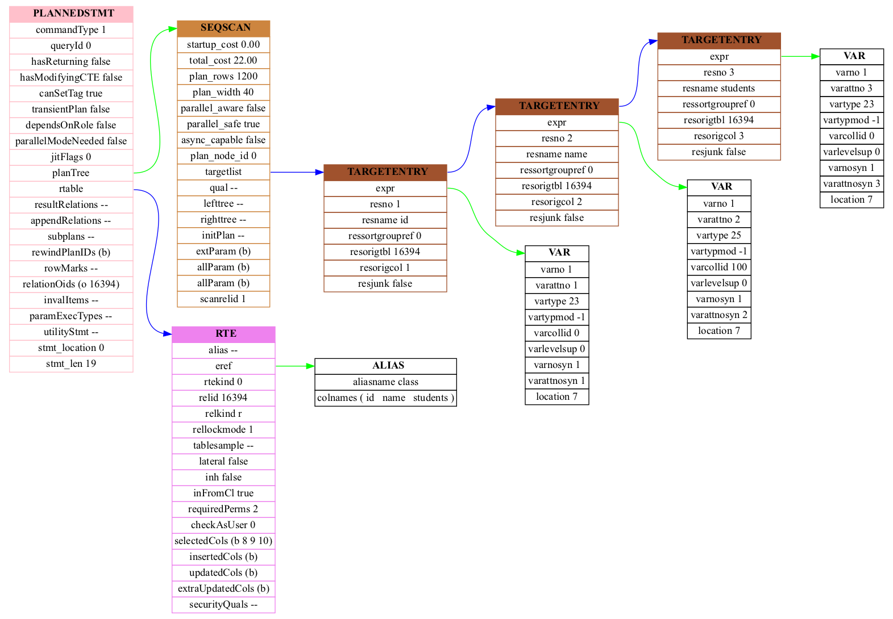

# pg_node2graph

The output of PostgreSQL node tree is very long and hard for the
developer to investigate. The pg_node2graph converts the output of the
PostgreSQL node tree into png formatted picture, which is quite
convenient for developing or debugging purposes.

pg_node2graph comes from [pgNodeGraph][]. It is rewritten using C++, and
improves the layout of List structure.

## Usage

Firstly, we can use the following SQL to create a new table:

```sql
CREATE TABLE class(id int, name text, students int);
```

```
postgres=# \d class
                Table "public.class"
  Column  |  Type   | Collation | Nullable | Default
----------+---------+-----------+----------+---------
 id       | integer |           |          |
 name     | text    |           |          |
 students | integer |           |          |
```

Secondly, make sure PostgreSQL print the parse node tree and plan node tree.

```
postgres=# set debug_print_parse = on;
postgres=# set debug_print_plan = on;
postgres=# set debug_pretty_print = on;
```

Then, let's execute the following SQL to retrive class information:

```
postgres=# SELECT * FROM class;
```

The PostgreSQL server will print the parse node tree and plan node tree
in the log. According to the type of queries, the output might be thousands
line. Here is an example.

```
2022-08-28 07:37:51.841 CST [22278] DETAIL:     {PLANNEDSTMT
           :commandType 1
           :queryId 0
           :hasReturning false
           :hasModifyingCTE false
           :canSetTag true
           :transientPlan false
           :dependsOnRole false
           :parallelModeNeeded false
           :jitFlags 0
           :planTree
              {SEQSCAN
              :startup_cost 0.00
              :total_cost 22.00
              :plan_rows 1200
              :plan_width 40
              :parallel_aware false
              :parallel_safe true
              :async_capable false
              :plan_node_id 0
              :targetlist (
                 {TARGETENTRY
                 :expr
                    {VAR
                    :varno 1
                    :varattno 1
                    :vartype 23
                    :vartypmod -1
                    :varcollid 0
                    :varlevelsup 0
                    :varnosyn 1
                    :varattnosyn 1
                    :location 7
                    }
                 :resno 1
                 :resname id
                 :ressortgroupref 0
                 :resorigtbl 16394
                 :resorigcol 1
                 :resjunk false
                 }
                 {TARGETENTRY
                 :expr
                    {VAR
                    :varno 1
                    :varattno 2
                    :vartype 25
                    :vartypmod -1
                    :varcollid 100
                    :varlevelsup 0
                    :varnosyn 1
                    :varattnosyn 2
                    :location 7
                    }
                 :resno 2
                 :resname name
                 :ressortgroupref 0
                 :resorigtbl 16394
                 :resorigcol 2
                 :resjunk false
                 }
                 {TARGETENTRY
                 :expr
                    {VAR
                    :varno 1
                    :varattno 3
                    :vartype 23
                    :vartypmod -1
                    :varcollid 0
                    :varlevelsup 0
                    :varnosyn 1
                    :varattnosyn 3
                    :location 7
                    }
                 :resno 3
                 :resname students
                 :ressortgroupref 0
                 :resorigtbl 16394
                 :resorigcol 3
                 :resjunk false
                 }
              )
              :qual <>
              :lefttree <>
              :righttree <>
              :initPlan <>
              :extParam (b)
              :allParam (b)
              :allParam (b)
              :scanrelid 1
              }
           :rtable (
              {RTE
              :alias <>
              :eref
                 {ALIAS
                 :aliasname class
                 :colnames ("id" "name" "students")
                 }
              :rtekind 0
              :relid 16394
              :relkind r
              :rellockmode 1
              :tablesample <>
              :lateral false
              :inh false
              :inFromCl true
              :requiredPerms 2
              :checkAsUser 0
              :selectedCols (b 8 9 10)
              :insertedCols (b)
              :updatedCols (b)
              :extraUpdatedCols (b)
              :securityQuals <>
              }
           )
           :resultRelations <>
           :appendRelations <>
           :subplans <>
           :rewindPlanIDs (b)
           :rowMarks <>
           :relationOids (o 16394)
           :invalItems <>
           :paramExecTypes <>
           :utilityStmt <>
           :stmt_location 0
           :stmt_len 19
           }
```

The node tree printed by PostgreSQL, as you have seen, is hard for
developers or users to read it. If we convert it to a picture, it will
be more readable. Let me show you how to use pg_node2graph to convert
the node tree to a picture format.

1. Copy and paste the node tree in text form.
2. Put it into `nodes` directory, the `nodes` directory is in the same
   directory as pg_node2graph executable.
3. Run pg_node2graph.

   ```bash
   $ ./pg_node2graph
   Processing file "example1.node" ... done
   ```

   After wait a moment, the node tree in png format is generated under
   the `images` directory.

   

[pgNodeGraph]: https://github.com/shenyuflying/pgNodeGraph
