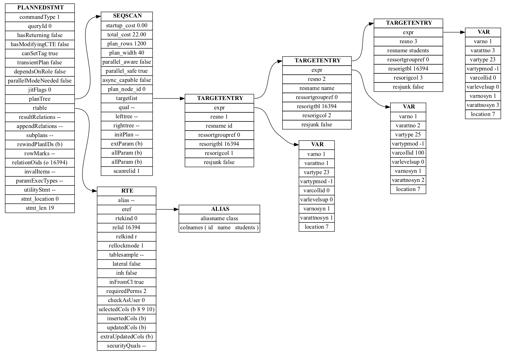

# Welcome to pg_node2graph

Welcome to the documentation of [pg_node2graph][]. 

## Introduction

The pg_node2graph is a tool that converts PostgreSQL node trees into PNG
formatted images. It is inspired by [pgNodeGraph][], rewritten in C++, and
boasting the following features:

* Improve the layout of list nodes.
* Support customized node colors.

## Installation

At present, you can only install pg_node2graph through source code.  There
are two ways to install pg_node2graph: make and meson.

### Install using make

    git clode https://github.com/japinli/pg_node2graph.git
    cd pg_node2graph
    make
    sudo make install

### Install using meson

    git clode https://github.com/japinli/pg_node2graph.git
    cd pg_node2graph
    meson setup build
    cd build
    meson compile
    sudo meson install

## Uninstallation

### Uninstall using make

If you install pg_node2graph through `make` command, you can remove it through
the following command:

    cd pg_node2graph
    sudo make uninstall

### Uninstall using meson

If you install pg_node2graph through `meson` command, you can remove it through
the following command:

    cd pg_node2graph/build
    sudo ninja uninstall

### Uninstall directly

Of course, the easist way to uninstall pg_node2graph is `rm` command, as
following:

    sudo rm /usr/local/bin/pg_node2graph

## Usage

The pg_node2graph requires [Graphviz][] graph visualization software.  To
install [Graphviz][], please see the [official documentation](https://graphviz.org/download/).

To generate a picture from the PostgreSQL node tree, you should follow the
following three steps:

1. Prepare PostgreSQL node tree.
   You can generate the PostgreSQL node tree into a log file by enabling the
   following parameters:

        SET debug_pretty_print TO on;
        SET debug_print_parse TO on;
        SET debug_print_plan TO on;

2. Extract node tree.  You can extract node tree information from the
   PostgreSQL log file after executing the SQL query, and then save the node
   tree into a file.

3. Generate a node picture.  Use the pg_node2graph to convert the node tree
   into a picture.

### Example

Firstly, create a new table `class`.

    CREATE TABLE class(id int, name text, students int);

Then, make sure PostgreSQL output the parse and plan node tree into log file.

    SET debug_pretty_print TO on; -- optional 
    SET debug_print_parse TO on;
    SET debug_print_plan TO on;

Let's execute the following SQL to fetch records from `class` table:

    SELECT * FROM class;

The PostgreSQL server will output the parse node tree and plan node tree
into the log file. According to the type of queries, the output might be
thousands of lines. Here is the plan node tree of the above query.

    2022-08-28 07:37:51.841 CST [22278] DETAIL:     {PLANNEDSTMT
           :commandType 1
           :queryId 0
           :hasReturning false
           :hasModifyingCTE false
           :canSetTag true
           :transientPlan false
           :dependsOnRole false
           :parallelModeNeeded false
           :jitFlags 0
           :planTree
              {SEQSCAN
              :startup_cost 0.00
              :total_cost 22.00
              :plan_rows 1200
              :plan_width 40
              :parallel_aware false
              :parallel_safe true
              :async_capable false
              :plan_node_id 0
              :targetlist (
                 {TARGETENTRY
                 :expr
                    {VAR
                    :varno 1
                    :varattno 1
                    :vartype 23
                    :vartypmod -1
                    :varcollid 0
                    :varlevelsup 0
                    :varnosyn 1
                    :varattnosyn 1
                    :location 7
                    }
                 :resno 1
                 :resname id
                 :ressortgroupref 0
                 :resorigtbl 16394
                 :resorigcol 1
                 :resjunk false
                 }
                 {TARGETENTRY
                 :expr
                    {VAR
                    :varno 1
                    :varattno 2
                    :vartype 25
                    :vartypmod -1
                    :varcollid 100
                    :varlevelsup 0
                    :varnosyn 1
                    :varattnosyn 2
                    :location 7
                    }
                 :resno 2
                 :resname name
                 :ressortgroupref 0
                 :resorigtbl 16394
                 :resorigcol 2
                 :resjunk false
                 }
                 {TARGETENTRY
                 :expr
                    {VAR
                    :varno 1
                    :varattno 3
                    :vartype 23
                    :vartypmod -1
                    :varcollid 0
                    :varlevelsup 0
                    :varnosyn 1
                    :varattnosyn 3
                    :location 7
                    }
                 :resno 3
                 :resname students
                 :ressortgroupref 0
                 :resorigtbl 16394
                 :resorigcol 3
                 :resjunk false
                 }
              )
              :qual <>
              :lefttree <>
              :righttree <>
              :initPlan <>
              :extParam (b)
              :allParam (b)
              :allParam (b)
              :scanrelid 1
              }
           :rtable (
              {RTE
              :alias <>
              :eref
                 {ALIAS
                 :aliasname class
                 :colnames ("id" "name" "students")
                 }
              :rtekind 0
              :relid 16394
              :relkind r
              :rellockmode 1
              :tablesample <>
              :lateral false
              :inh false
              :inFromCl true
              :requiredPerms 2
              :checkAsUser 0
              :selectedCols (b 8 9 10)
              :insertedCols (b)
              :updatedCols (b)
              :extraUpdatedCols (b)
              :securityQuals <>
              }
           )
           :resultRelations <>
           :appendRelations <>
           :subplans <>
           :rewindPlanIDs (b)
           :rowMarks <>
           :relationOids (o 16394)
           :invalItems <>
           :paramExecTypes <>
           :utilityStmt <>
           :stmt_location 0
           :stmt_len 19
           }

You should copy and paste the node tree in text form and save it into a file,
such as `nodes/example1.node`.

Finally, run the following command to generate a picture for `nodes/example1.node`.

    pg_node2graph nodes/example1.node

If there is no erros, you will see message like this.

    processing "nodes/example1.node" ... ok
    
At last, you can see the `nodes` directory contains a file named
`example1.node.png`, which is our picture converted from the
`nodes/example1.node`.

### Customize colors

The pg_node2graph supports customizing the node's color by providing a color
mapping configuration file.

In the configuration file, lines that begin with the hash symbol are comments.
The blank lines will be ignored.  The other lines are color mappings.

The color mapping configuration contains three parts, separated by commas:

- node name
- background and border-color
- font color of the first record in a node (optional)

For example:

    PLANNEDSTMT, teal, pink
    QUERY, webmaroon, red
    RTE, salmon
    SEQSCAN, webpurple, white
    TARGETENTRY, springgreen
    VAR, orchid, whitesmoke
    ALIAS, tan

The above mappings will change the color for `PLANNEDSTMT`, `QUERY`, `RTE`,
`SEQSCAN`, `TARGETENTRY`, `VAR` and `ALIAS` nodes.  Assuming we save it
into `test_node_color.map`, you can run the following command to generate
a new picture with colors.

    pg_node2graph -c -n test_node_color.map nodes/example1.node

Here is the new picture with colors.

You can visit [here](https://graphviz.org/doc/info/colors.html) to find more
color names.

Enjoy yourself!

[pg_node2graph]: https://github.com/japinli/pg_node2graph
[pgNodeGraph]: https://github.com/shenyuflying/pgNodeGrap
[Graphviz]: https://graphviz.org
